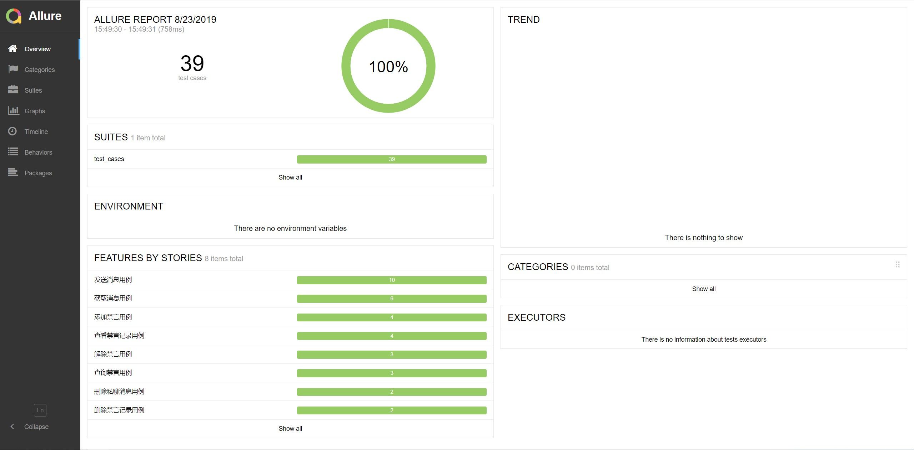
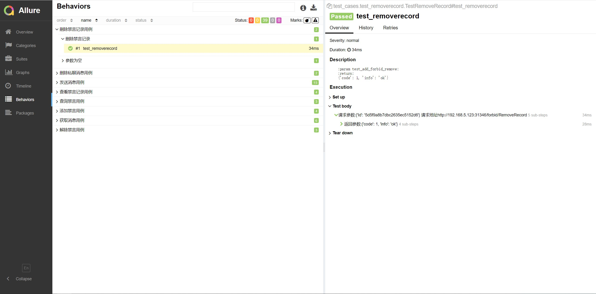

# [python+pytest+allure](https://shimo.im/docs/7ZzkLVJ1YgriB3QE)
## 代码结构
```
├─chat_base           		脚本配置_url路径(脚本默认请求地址为内网)
│  
├─chat_method         		内部方法
│ 
├─report          	        测试报告
│ 
├─test_cases        		测试用例
│ 
└─run.py                        脚本入口    
```
## 代码说明:这是一份ci集成的接口测试脚本,无视用例内容,主要是allure跟pytest的使用


报告详情：





